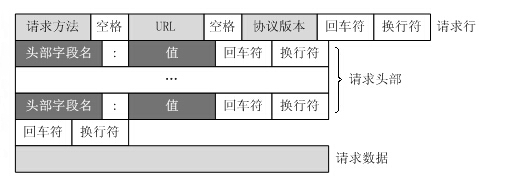

# Linux服务器项目
## 锁机制 (`locker.h`)
封装了线程同步机制（由于线程池多个线程共享请求队列，因此需要实现线程同步），包括互斥锁、条件变量和信号量。
- `locker`类: 封装了互斥锁相关操作，包括加锁和解锁操作
- `cond`类: 封装了条件变量相关操作
- `sem`类: 封装了信号量相关操作

用到了互斥锁的部分有：
1. 线程池中的**请求队列**是多线程共享的，因此每次操作请求队列（链表格式）的时候都需要先加锁，操作完毕后再解锁；
2. 

用到了信号量的部分有：
1. 用于**唤醒线程**，告诉线程请求队列中有待处理的任务。具体方法是，当有任务加入请求队列时，执行P操作(post)，即信号量加1，当线程处理任务时执行V操作(wait)，如果当前信号量为0，则阻塞，表示没有任务处理，如果当前信号量大于0，则将信号量减1，获取请求队列中的任务并执行之。

## 线程池(`theadpool.h`)
**原理：**

线程池本质上上使用空间换时间，首先预先初始化多个线程，当有任务到来时，就从线程池中取出一个线程执行，执行完毕后，再将线程返回到线程池中等待下一个任务的到来，这样就不需要每次都初始化和释放线程了，大大的提高运行效率。

具体的做法是设置一个请求队列（list）用于存放用户请求，当有任务到来时，由主线程将任务加入请求队列，线程池类提供一个`append`方法用于添加任务到请求队列，主线程中调用这个方法添加新的任务。通过信号量通知线程处理，处理完毕后线程再次进入等待状态。

**变量说明：**
1. 用到了模版定义一个任务T，方便代码复用，可能不同线程需要处理不同任务。
2. 线程池用一个数组`m_threads`表示，线程的数量为`m_thread_number`。
3. 服务器需要处理的客户请求被维护在一个请求队列中，用链表`list<*T>`表示，链表最大长度限制为`m_max_requests`
4. 由于多个线程都能访问请求队列，因此需要用一个互斥锁`m_queuelocker`保护请求队列
5. 定义一个信号量 `m_queuestat`，用于判断是否有任务需要处理。
6. 定义一个布尔类型变量`m_stop`，用于判断是否结束数量。

**方法说明：**
- 构造函数:
  1. 初始化变量，包括初始化线程池数组
  2. 创建thread_number个线程并设置为线程分离，之所以要设置为线程分离是位为了方便回收线程。
- 析构函数:
  1. 释放线程池 m_threads;
  2. 将m_stop置为true，通知线程释放
- `append`: 向请求队列添加请求
  1. 由于请求队列是多个线程的共享资源，因此在操作前需要加锁(m_queuelocker)
  2. 判断当前的请求队列长度是否大于m_max_request，若大于则返回false，否则将用户请求加入请求队列。
  3. m_queuestat信号量调用post操作，表示多了一个任务要处理
私有方法说明：
- `worker`: 作为线程函数，线程函数必须要求是静态函数（因为`pthread_create`函数要求线程满足函数必须满足格式
    ```
    void *threadfun(void *args);
    ```
    而普通的成员函数/虚函数实际上的格式为 
    ```
    void *className::threadfun(this, void *args);
    ```
    因此不满足要求。而为了让静态的worker函数能够访问类的非静态对象，采用的方法是将`this`作为参数传入`worker`函数。
- `run`: 线程运行
  1. 循环等待任务处理，直到`m_stop`为`true`；
  2. 调用信号量`m_queuestat`的`wait`方法：
     - 若信号量的值为0，则阻塞，说明当前没有待处理任务
     - 若信号量值不为0，先判断请求队列是否为空，若不为空则取出一个任务执行
  3. 由于需要用到请求队列，需要在操作请求队列前进行加锁，结束后解锁
 
## HTTP请求类(`http_conn.h`)
### 变量说明
**静态变量**用于存放一些全局的属性，包括
1. epoll文件描述符`m_epollfd`；
2. 当前的用户总数`m_user_count`；
3. 读写缓冲区的大小`READ_BUFFER_SIZE`和`WRITE_BUFFER_SIZE`

**私有变量**用于存放当前连接的一些属性，包括：
1. 当前连接的信息，如用于操作该连接的socket文件描述符`m_sockfd`、该连接的客户端地址`m_addr`。
2. 读写缓冲区的信息，如读缓冲区`m_read_buf`（`char[]`）和用于标识读缓冲区中已经读入的客户端数据的最后一个字节的下一个位置`m_read_idx`；
3. 解析http请求所需参数，包括当前正在分析的读缓冲区的位置`m_checked_idx`、正在解析的行的起始位置`m_start_line`和主状态机所处状态`m_check_state`
4. http请求的结果，包括URL、协议版本、请求方法等

### 工具类方法说明
包括用于将文件描述符设置为非阻塞的函数`setnonblocking`，该函数通过调用fcntl方法实现，修改`flag`添加`O_NONBLOCK`属性即可。

除此之外还有`addfd/removefd/modfd`方法，其中：
`addfd`用于向epoll中添加需要监听的文件描述符，需要添加的文件描述符包括listenfd（服务器监听socket文件描述符）、connfd（客户连接的socket文件描述符）。需要注意的是：（1）文件描述符要设置为非阻塞；（2）添加客户连接的sockfd时需要设置为EPOLLONESHOT模式，保证一个socket连接同一时间只会被一个线程操作。

`removefd`方法用于从epoll内核事件表中删除事件。`modfd`方法用于修改epoll中的文件描述符，它的一个很重要的功能是用来重置`EPOLLONESHOT`事件，保证下次有读事件触发时候可以被epoll监听到

> 常用的epoll事件：
> - EPOLLIN：表示对应的文件描述符可以读（包括对端SOCKET正常关闭）；
> - EPOLLOUT：表示对应的文件描述符可以写；
> - EPOLLPRI：表示对应的文件描述符有紧急的数据可读（这里应该表示有带外数据到来）；
> - EPOLLERR：表示对应的文件描述符发生错误；
> - EPOLLHUP：表示对应的文件描述符被挂断；
> - EPOLLRDHUP：表示对应的文件描述符读关闭
> - EPOLLET： 将EPOLL设为边缘触发(Edge Triggered)模式，这是相对于水平触发(Level Triggered)来说的。
> - EPOLLONESHOT：只监听一次事件，当监听完这次事件之后，如果还需要继续监听这个socket的话，需要再次把这个socket加入到EPOLL队列里


### 类方法说明

**init/close_conn**

`init`函数用于初始化新的连接，需要进行的操作包括：（1）设置端口复用；（2）将新的sockfd添加到epoll内核事件表中；（3）更新总用户数量 。

`close_conn`函数用于关闭客户连接，需要进行的操作包括：（1）将`m_sockfd`从epoll内核事件表中删除（调用removefd实现）；（2）将该`m_sockfd`置为-1，也就是让该文件描述符失效；（3）总用户数量减少1个。

**read/write**

`read`用于一次性读取数据，直到对方关闭连接，读数据用的是`recv`函数，这是socket提供了特有的读入数据函数，若返回值为0表示对方已关闭连接，返回值>0表示读取正确，返回的是读入的数据长度，需要更新m_read_idx，若返回值为-1则表示读取出错，如果errno为`EAGAIN`或者`EWOULDBLOCK`表示读取完毕，接受缓冲区为空，在非阻塞io下会立刻返回-1.

`write`

**process**

用于解析用户发送来的请求报文（proactor模式下数据的读入由主线程完成），以及获取用户所请求的资源，拼接得到响应报文，发送给客户端 。

1、解析HTTP请求

请求报文：
```html
GET / HTTP/1.1\r\n
Host: 47.115.202.0:12345\r\n
Connection: keep-alive
Upgrade-Insecure-Requests: 1
User-Agent: Mozilla/5.0 (Macintosh; Intel Mac OS X 10_15_7) AppleWebKit/537.36 (KHTML, like Gecko) Chrome/114.0.0.0 Safari/537.36 Edg/114.0.1823.79
Accept: text/html,application/xhtml+xml,application/xml;q=0.9,image/webp,image/apng,*/*;q=0.8,application/signed-exchange;v=b3;q=0.7
Accept-Encoding: gzip, deflate
Accept-Language: zh-CN,zh;q=0.9,en;q=0.8,en-GB;q=0.7,en-US;q=0.6
```



用到了**有限状态机**，包括一个从状态机（用于解析一行）和一个主状态机（标识当前正在分析请求行/头部字段/请求体）。从状态机就是一个`parse_line`函数，用于从`m_read_buffer`中解析处一行，它的状态包括`LINE_OK,LINE_BAD,LINE_OPEN`，分别表示读取到一个完整行、行出错、行数据尚不完整。具体的处理过程如下：
1. 挨个检查`m_read_buffer`中`m_checked_idx`到`m_read_idx-1`之间的字节，判断是否存在行结束符，并更新`m_checked_idx`
2. 如果不存在行结束符，则返回`LINE_OPEN`，后续程序继续调用`recv`接受更多数据。
3. 如果读取到了完整行，就返回`LINE_OK`，并将该行交给`process_read`中的主状态机来处理，主状态机根据当前的状态`m_check_state`判断该行是请求首行、请求头或者请求体，分别交给不同的函数处理。

2、生成响应

