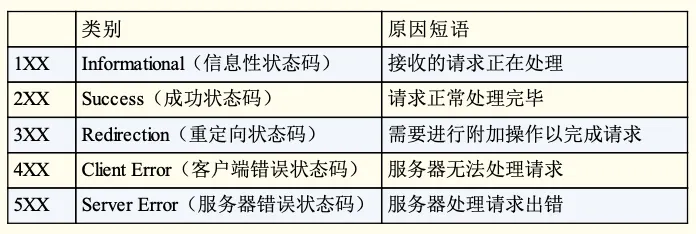

# Linux服务器项目
## 锁机制 (`locker.h`)
封装了线程同步机制（由于线程池多个线程共享请求队列，因此需要实现线程同步），包括互斥锁、条件变量和信号量。
- `locker`类: 封装了互斥锁相关操作，包括加锁和解锁操作
  > 线程池中的**请求队列**是多线程共享的，因此每次操作请求队列（链表格式）的时候都需要先加锁，操作完毕后再解锁
- `cond`类: 封装了条件变量相关操作
- `sem`类: 封装了信号量相关操作
  > 用于**唤醒线程**，告诉线程请求队列中有待处理的任务。具体方法是，当有任务加入请求队列时，执行P操作(post)，即信号量加1，当线程处理任务时执行V操作(wait)，如果当前信号量为0，则阻塞，表示没有任务处理，如果当前信号量大于0，则将信号量减1，获取请求队列中的任务并执行之。

## 线程池(`theadpool.h`)
**原理：**

线程池本质上上使用空间换时间，首先预先初始化多个线程，当有任务到来时，就从线程池中取出一个线程执行，执行完毕后，再将线程返回到线程池中等待下一个任务的到来，这样就不需要每次都初始化和释放线程了，大大的提高运行效率。

具体的做法是设置一个请求队列（list）用于存放用户请求，当有任务到来时，由主线程将任务加入请求队列，线程池类提供一个`append`方法用于添加任务到请求队列，主线程中调用这个方法添加新的任务。通过信号量通知线程处理，处理完毕后线程再次进入等待状态。

**变量说明：**
1. 用到了模版定义一个任务T，方便代码复用，可能不同线程需要处理不同任务。
2. 线程池用一个数组`m_threads`表示，线程的数量为`m_thread_number`。
3. 服务器需要处理的客户请求被维护在一个请求队列中，用链表`list<*T>`表示，链表最大长度限制为`m_max_requests`
4. 由于多个线程都能访问请求队列，因此需要用一个互斥锁`m_queuelocker`保护请求队列
5. 定义一个信号量 `m_queuestat`，用于判断是否有任务需要处理。
6. 定义一个布尔类型变量`m_stop`，用于判断是否结束数量。

**方法说明：**
- 构造函数:
  1. 初始化变量，包括初始化线程池数组
  2. 创建thread_number个线程并设置为线程分离，之所以要设置为线程分离是位为了方便回收线程。
- 析构函数:
  1. 释放线程池 m_threads;
  2. 将m_stop置为true，通知线程释放
- `append`: 向请求队列添加请求
  1. 由于请求队列是多个线程的共享资源，因此在操作前需要加锁(m_queuelocker)
  2. 判断当前的请求队列长度是否大于m_max_request，若大于则返回false，否则将用户请求加入请求队列。
  3. m_queuestat信号量调用post操作，表示多了一个任务要处理
私有方法说明：
- `worker`: 作为线程函数，线程函数必须要求是静态函数（因为`pthread_create`函数要求线程满足函数必须满足格式
    ```
    void *threadfun(void *args);
    ```
    而普通的成员函数/虚函数实际上的格式为 
    ```
    void *className::threadfun(this, void *args);
    ```
    因此不满足要求。而为了让静态的worker函数能够访问类的非静态对象，采用的方法是将`this`作为参数传入`worker`函数。
- `run`: 线程运行
  1. 循环等待任务处理，直到`m_stop`为`true`；
  2. 调用信号量`m_queuestat`的`wait`方法：
     - 若信号量的值为0，则阻塞，说明当前没有待处理任务
     - 若信号量值不为0，先判断请求队列是否为空，若不为空则取出一个任务执行
  3. 由于需要用到请求队列，需要在操作请求队列前进行加锁，结束后解锁
 
## HTTP请求类(`http_conn.h`)
### 变量说明
**静态变量**用于存放一些全局的属性，包括
1. epoll文件描述符`m_epollfd`；
2. 当前的用户总数`m_user_count`；
3. 读写缓冲区的大小`READ_BUFFER_SIZE`和`WRITE_BUFFER_SIZE`；
4. 文件名最大长度`FILENAME_LEN`；

**私有变量**用于存放当前连接的一些属性，包括：
1. 当前连接的信息，如用于操作该连接的socket文件描述符`m_sockfd`、该连接的客户端地址`m_addr`。
2. 读写缓冲区的信息，如读缓冲区`m_read_buf`（`char[]`）和用于标识读缓冲区中已经读入的客户端数据的最后一个字节的下一个位置`m_read_idx`。
3. 解析http请求所需参数，包括当前正在分析的读缓冲区的位置`m_checked_idx`、正在解析的行的起始位置`m_start_line`和主状态机所处状态`m_check_state`。
4. http请求的结果，包括URL、协议版本、请求方法等。
5. 操作http请求的资源的相关变量，包括存储文件名的c字符数组`m_read_file`（由资源根目录地址和url中的文件名拼接得到），目标文件的状态`m_file_stat`（可以用于判断文件是否存在，借助`st_mode`可以判断文件是否为目录、是否可读、访问权限，借助`st_size`可以判断文件大小），最后需要将文件数据映射到内存映射去区（`mmap`），内存映射区的地址为`m_file_address`。
6. 用于将http响应写入到连接socket的参数，包括用于分散读（`writev`）的参数`m_iv`和`m_iv_count`，和用于发送数据的参数`btytes_to_send`和`bytes_have_send`。

### 工具类方法说明
包括用于将文件描述符设置为非阻塞的函数`setnonblocking`，该函数通过调用fcntl方法实现，修改`flag`添加`O_NONBLOCK`属性即可。

除此之外还有`addfd/removefd/modfd`方法，其中：
`addfd`用于向epoll中添加需要监听的文件描述符，需要添加的文件描述符包括listenfd（服务器监听socket文件描述符）、connfd（客户连接的socket文件描述符）。需要注意的是：（1）文件描述符要设置为非阻塞；（2）添加客户连接的sockfd时需要设置为EPOLLONESHOT模式，保证一个socket连接同一时间只会被一个线程操作。

`removefd`方法用于从epoll内核事件表中删除事件。`modfd`方法用于修改epoll中的文件描述符，它的一个很重要的功能是用来重置`EPOLLONESHOT`事件，保证下次有读事件触发时候可以被epoll监听到

> 常用的epoll事件：
> - EPOLLIN：表示对应的文件描述符可以读（包括对端SOCKET正常关闭）；
> - EPOLLOUT：表示对应的文件描述符可以写；
> - EPOLLPRI：表示对应的文件描述符有紧急的数据可读（这里应该表示有带外数据到来）；
> - EPOLLERR：表示对应的文件描述符发生错误；
> - EPOLLHUP：表示对应的文件描述符被挂断；
> - EPOLLRDHUP：表示对应的文件描述符读关闭
> - EPOLLET： 将EPOLL设为边缘触发(Edge Triggered)模式，这是相对于水平触发(Level Triggered)来说的。
> - EPOLLONESHOT：只监听一次事件，当监听完这次事件之后，如果还需要继续监听这个socket的话，需要再次把这个socket加入到EPOLL队列里


### 公有类方法说明
**1、`process()`函数**

用于解析用户发送来的请求报文（proactor模式下数据的读入由主线程完成），以及获取用户所请求的资源，拼接得到响应报文，发送给客户端 。

- 解析用户请求是通过调用私有函数`process_read`完成的，该函数返回解析http请求的结果，若解析结果为`NO_REQUEST`，即请求不完整，则用`modfd`重置`m_sockfd`的状态为`EPOLLIN`，epoll就会继续监听该连接socket上的可读事件，当读缓冲区不为空时，再重新将该连接加入到请求队列，工作线程继续获取用户数据（注意这里不需要调用`init`重新初始化其他信息，直接在之前的状态下继续读，直到读取到了完整响应并且生成了响应才需要调用`init`）。
- 生成响应用是通过调用私有函数`process_write`函数完成的，该函数返回写响应的结果（成功/失败），若失败则关闭连接。

**2、`init`函数**

用于初始化新的连接，需要进行的操作包括设置端口复用、将新的sockfd添加到epoll内核事件表中，以及更新总用户数量。

**`close_conn`函数**

用于关闭客户连接，需要进行的操作包括：将连接socket从epoll内核事件表中删除、将该`m_sockfd`置为-1，也就是让该文件描述符失效，以及更新总用户数量

**`read`函数**
用于读取HTTP请求报文，用非阻塞的方式一次性读完所有数据，直到对方关闭连接

- 读数据用的是`recv`函数，这是socket提供了特有的读入数据函数，若返回值为0表示对方已关闭连接，返回`false`；
  返回值>0表示读取正确，更新`m_read_idx`，返回`true`；若返回值为-1则表示读取出错，如果errno为`EAGAIN`或者
  `EWOULDBLOCK`表示读取完毕，接受缓冲区为空，返回`true`，其它错误情况下返回`false`。
- 读到的数据存储在该http连接对象的`m_read_buf`中，后续工作线程通过调用`process`函数处理读取到的数据。
- 该函数是在主线程中调用，当`epollfd`检测到可读事件时调用`read`函数一次性读取所有数据，
  如果`read`返回值为`true`则将该连接socket加入到请求队列供线程池操作，若返回值为`false`，
  则说明是读失败了或对方已关闭连接，就关闭连接socket。

**5、`write`函数**

用于写HTTP响应，同样是用非阻塞的方式一次性写完所有数据，要写的内容包括了响应状态行、响应头和响应体，
采用的方式是分散写`writev`，即把多个内存块的数据一次性写入指定的文件描述符`m_sockfd`
1. 若要发送的数据字节数为0，即`bytes_to_sent`等于0，说明本次响应结束，将epoll内核事件表中
该连接socket重新设置为`EPOLLIN`模式，表示继续监听数据可读事件发生。
2. 接下来用`wirtev`采用非阻塞的方式循环写入数据
  - 若`writev`返回值为-1，说明写入错误，可能包括两种情况：i. `errno`为`EAGAIN`，表示tcp写缓冲区暂时没有空间了，
  这种情况下修改epoll内核事件表中该连接socket的监听事件为`EPOLLOUT`，当socket写缓冲区从满到不满状态时候会触发`EPOLLOUT`事件，这个时候再把剩余数据发送出去即可，所以这时还不能调用`init`；ii. 其它错误，则释放内存映射去区并返回`false`，主线程中发现`write`失败后，就会关闭连接。
  - 若`writev`返回值大于等于0，返回的值为发送的数据的字节数，则更新`bytes_to_send`和`bytes_have_send`，
  并调整待发送内存块剩余数据的起始位置为长度，等待下一轮循环继续发送。
  - 若`bytes_to_send`小于等于0，说明数据发送完毕了，此时需要释放内存缓冲区并重新注册事件`EPOLLIN`。
  如果`m_linger`为真说明客户端希望能保持连接，这时需要调用`init`初始化变量，返回`true`，表示并不断开连接，否则返回`false`。

### 私有类方法说明

**1、工具类函数：**
1. `init`函数：用于初始化除了该连接socket属性之外的其它信息，和公有的`init`的区别是，公有的`init`是用来初始化一个新连接的，
而私有的`init`是用于在一次请求完成后清空读写缓冲区等等，继续等待下一次请求，不需要重新初始化整个连接。
2. `unmap`函数：用来释放内存映射区，通过调用`munmap`实现。

**2、解析http请求**

请求报文：
```html
GET / HTTP/1.1\r\n
Host: 47.115.202.0:12345\r\n
Connection: keep-alive\r\n
Upgrade-Insecure-Requests: 1\r\n
User-Agent: Mozilla/5.0 (Macintosh; Intel Mac OS X 10_15_7) AppleWebKit/537.36 (KHTML, like Gecko) Chrome/114.0.0.0 Safari/537.36 Edg/114.0.1823.79\r\n
Accept: text/html,application/xhtml+xml,application/xml;q=0.9,image/webp,image/apng,*/*;q=0.8,application/signed-exchange;v=b3;q=0.7\r\n
Accept-Encoding: gzip, deflate\r\n
Accept-Language: zh-CN,zh;q=0.9,en;q=0.8,en-GB;q=0.7,en-US;q=0.6\r\n
\r\n
```

用到了**有限状态机**，包括一个主状态机`process_read`和一个从状态机`parse_line`
1. 主状态机用来标识当前正在分析请求报文的哪一个部分，包括当前正在分析请求行、头部字段、请求体，其返回值为http请求的结果。
  根据当前状态判断要将该行交给`parse_request_line/parse_headers/parse_content`中的哪个函数处理，
  这些函数的返回值是http请求结果，当检测到返回结果为`GET_REQUEST`时，说明解析到了一个完整请求，
  下一步是处理请求的内容，包括获取请求资源等，这一步通过调用`do_request`函数实现。
2. 从状态机用于标识解析当前行的状态，每次从`m_read_buffer`中解析出一行，它的状态包括`LINE_OK,LINE_BAD,LINE_OPEN`，分别表示读取到一个完整行、行出错、行数据尚不完整。具体的处理过程如下：
    1. 挨个检查`m_read_buffer`中`m_checked_idx`到`m_read_idx-1`之间的字节，判断是否存在行结束符，并更新`m_checked_idx`
    2. 如果不存在行结束符，则返回`LINE_OPEN`，后续程序继续调用`recv`接受更多数据。
    3. 如果读取到了完整行，就返回`LINE_OK`，并将该行交给`process_read`中的主状态机来处理，主状态机根据当前的状态`m_check_state`判断该行是请求首行、请求头或者请求体，分别交给不同的函数处理。


**3、生成响应**

http响应格式：
```
HTTP/1.1 200 OK
Bdpagetype: 1
Bdqid: 0xfb0d743100040ad2
Cache-Control: private
Connection: keep-alive
Content-Encoding: gzip
Content-Type: text/html;charset=utf-8
Date: Fri, 24 Dec 2021 08:20:44 GMT
Expires: Fri, 24 Dec 2021 08:20:44 GMT
Server: BWS/1.1
Set-Cookie: BDSVRTM=17; path=/
Set-Cookie: BD_HOME=1; path=/
Set-Cookie: H_PS_PSSID=35635_34439_35104_35628_35488_35436_35456_34584_35491_35584_35586_34873_35317_26350_35610_35562; path=/; domain=.baidu.com
Strict-Transport-Security: max-age=172800
Traceid: 1640334044050133761018090243032019634898
X-Frame-Options: sameorigin
X-Ua-Compatible: IE=Edge,chrome=1
Transfer-Encoding: chunked
```


核心函数为`process_write`，该函数根据http请求的解析结果生成对应的响应信息，响应信息包括响应状态行、响应头和响应体。
所有的响应数据通过调用`add_response`函数写入写缓冲区，该函数用到了c语言的可变参数编程。

> todo:
> - 实现核心代码 ✅
> - 实现定时监测不活跃的连接，释放不活跃连接（因为可用的文件描述符是有限的，
  不活跃的用户把文件描述符都占用了之后，新的连接就无法加入进来了）
> - 支持更多的http请求方法，目前仅支持GET方法；
> - 加入用户密码登录功能，结合数据库；
> - 支持设置epoll不同的触发模式（LT/ET）