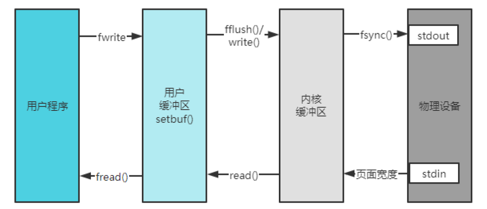

# WebServer version3.0

1. 使用Epoll边沿触发的IO多路复用技术，非阻塞IO，使用Reactor模式
2. 使用多线程充分利用多核CPU，并使用线程池避免线程频繁创建销毁的开销
3. 使用基于小根堆的定时器关闭超时请求
4. 主线程只负责accept请求，并以Round Robin的方式分发给其它IO线程(兼计算线程)，锁的争用只会出现在主线程和某一特定线程中。
5. 使用eventfd实现了线程的异步唤醒
6. 使用生产者消费者模型（双缓冲区技术）实现了简单的异步日志系统
7. 为减少内存泄漏的可能，使用智能指针等RAII机制
8. 使用状态机解析了HTTP请求,支持管线化
9. 支持优雅关闭连接

## 运行
```shell
./WebServer [-t thread_numbers] [-p port] [-l log_file_path(should begin with '/')]
```
webbench测试
```shell
./webbench -c 10000 -t 30 http://47.115.202.0:10000/index.html
```

## Multi-Reactor 框架

包含一个 MainReactor 和多个 SubReactor，每个 Reactor 实现**持续**的监听一组 fd，并根据每个fd上发生的事件调用给你相应的处理函数。
-  MainReactor 在主线程中创建，负责持续监听用户连接，并将其分发给 SubReactor
-  SubReactor 是由主线程预先创建好的一组线程池，负责处理具体的用户请求

核心的组建包括：
- Server类：入口类，其中创建 acceptChannel 和线程池，用来处理连接事件
- Channel类：对于文件描述符的封装
- EpollPoller类：对于epoll的封装，在其中添加、删除、修改channel，以及通过IO多路复用监听文件描述符上的事件
- EventLoop类：while循环的封装，有个epoll一直收集事件
- EventLoopThread类：EventLoop的线程类，是子线程来使用EventLoop来监控连接套接字的
- EventLoopThreadPool类：包含指定数量多EventLoopThread来分担所有的连接套接字
- HttpData类：连接类，在其中读取数据、处理数据、分发数据

其它：
- Logging类：异步日志
- Timer类：定时器

### Channel类
相当于一个文件描述符的保姆，负责管理这个文件描述符的注册的事件、实际发生的事件、事件处理函数、注册各个事件的处理函数等。方便IO多路复用模块通过Channel管理对应的fd。

**重要的成员变量：**

1. 该channel管理的文件描述符`fd_`，运行该Channel的`EventLoop`，以及持有该channel的HttpData对象`holder_`
2. 事件相关：要监听的事件`events_`、实际发生的事件`revents_`，上次监听的事件`lastEvents_`（用于更新在更新events_之前检查是否发生了变化，若变了再执行更新操作）
3. 各个事件的回调函数，需求不同设置的回调函数也不同，包括 `readHandler, writeHandler, connHandler, errorHandler`

这里的Channel分为两类：
-  若为 `acceptChannel`，则在开启服务器时设置，`readHandler`中注册的是`Server::handNewConn`函数，用于接收一个新连接，`connHanlder`中注册的是`Server::handThisConn`函数，用于更新`listenfd`上注册的事件
- 若为 `eventChannel`， 则在初始化连接的时候由`HttpData`的构造函数设置，其中`readHandler`中注册的是`HttpData::handleRead`函数，用于解析http请求，`writeHandler`中注册的是`HttpData::handleWrite`函数，用于将http响应

**重要的成员方法：**
1. 向channel对象注册各类事件的处理函数
    ```c++
    void setReadHandler(CallBack cb) { readHandler_ = std::move(cb); }
    void setWriteHandler(CallBack cb) { writeHandler_ = std::move(cb); }
    void setErrorHandler(CallBack cb) { errorHandler_ = std::move(cb); }
    void setConnHandler(CallBack cb) { connHandler_ = std::move(cb); }
    ```
2. 设置Channel中的文件描述符的感兴趣事件（注册事件到IO多路复用模块由`EventLoop`中的`updatePoller`实现，这里只是告知Channel你所监管的文件描述符都对哪些事件类型感兴趣，还没有实现事件注册）
    ```c++
    void setEvents(int ev) { events_ = ev; }
    ```
3. 当事件监听器监听到该文件描述符上发生了事件，将文件描述符实际发生的事件写入Channel
    ```c++
    void setRevents(int ev) { revents_ = ev; }
    ```
4. Channel根据自己文件描述符上实际发生的事件（由`revents_`得知）来选择调用不同的事件处理函数
    ```c++
    void handleEvents()
    ```

### EpollPoller类
```c++
// 实现一个事件监听器：
// 功能：1. 负责监听文件描述符事件是否触发；2. 返回发生事件的文件描述符的具体事件
// 说明：在multi-reactor模型中，有多少个reactor就有多少个poller，外界通过调用poll方法开启监听
class EpollPoller : noncopyable {
public:
    EpollPoller();
    ~EpollPoller();
    // 实现增加、修改、删除文件描述符
    // 一个Epoll负责监听多个文件描述符，这里的文件描述符都是由Channel管理的
    // 因此可以通过指向Channel的shared_ptr实现epoll中对应文件描述符监听事件状态的修改
    void addfd(SPChannel request, int timeout);
    void modfd(SPChannel request, int timeout);
    void delfd(SPChannel request);
    int getEpollfd() { return epollfd_; }

    // ************* 重要 ***************
    std::vector<std::shared_ptr<Channel>> poll(); // 开启IO复用
    // poll方法是Poller的核心方法，用于获取内核事件表中最新的事件，返回需要处理的活跃Channel列表
    // 当外部调用poll方法的时候，该方法底层其实是通过epoll_wait获取这个事件监听器上发生事件的fd及其对应发生的事件
    // 我们知道每个fd都是由一个Channel封装的，通过哈希表fd2chan_可以根据fd找到封装这个fd的Channel
    // 将事件监听器监听到该fd发生的事件写进这个Channel中的revents成员变量中。
    // 然后把这个Channel写入返回列表中，当外界调用完poll之后就能拿到事件监听器的监听结果
    // *********************************

    // 定时器相关
    void addTimer(std::shared_ptr<Channel> req, int timeout);
    void handleExpired() { timerManager_.handleExpiredEvent(); } 
private:
    static const int MAXFDS = 100000;
    int epollfd_; // 通过epoll_create方法返回的epoll句柄
    std::vector<epoll_event> events_; // 内核事件表
    std::shared_ptr<Channel> fd2chan_[MAXFDS];
    std::shared_ptr<HttpData> fd2http_[MAXFDS];

    TimerManager timerManager_; //定时器
};
```

### EventLoop类
刚才的Poller是封装了和事件监听有关的方法和成员，调用一次`EpollPoller::poll`方法它就能给你返回事件监听器的监听结果（发生事件的fd 及其 发生的事件）。作为一个网络服务器，需要有持续监听、持续获取监听结果、持续处理监听结果对应的事件的能力，也就是我们需要循环的去 【调用`EpollPoller::poll`方法获取实际发生事件的Channel集合，然后调用这些Channel里面保管的不同类型事件的处理函数（调用`Channel::handlerEvent`方法）】

EventLoop就是负责实现“循环”，负责驱动“循环”的重要模块！！Channel和Poller其实相当于EventLoop的手下，EventLoop整合封装了二者并向上提供了更方便的接口来使用。

**one loop per thread含义**：

每个EventLoop绑定一个Thread，充份利用了多核cpu的能力，每一个核的线程负责循环监听一组文件描述符的集合。

**核心方法：`EventLoop::loop()`**

```c++
void EventLoop::loop() {
    assert(!looping_); // 验证当前是否处于looping状态
    assert(isInLoopThread()); // 验证是否运行在正确的线程上
    looping_ = true;
    quit_ = false;
    std::vector<SPChannel> ret;
    while (!quit_) {
        ret.clear();
        ret = poller_->poll(); // 返回活跃用户列表
        eventHandling_ = true;
        for (auto& it : ret) it->handleEvents(); // 每个channel轮流执行任务
        eventHandling_ = false;
        doPendingFunctors();
        poller_->handleExpired(); // 最后再处理超时事件
    }
    looping_ = false;
}
```

每个EventLoop对象绑定一个线程，该线程内就是一直执行`loop()`函数，
1. 执行 poller_->poll() 通过IO复用检测有事件的通道
2. 针对活动通道调用 sp_channel->handelEvents() 处理返回的事件
   - 若为acceptChannel，即listenfd发生事件，则调用Server::handleNewConn()、
3. 执行 doPendingFunctors() 处理额外的任务
4. 调用 poller_->handleExpired() 处理超时事件

> **doPendingFucntors：**
> 用于可以处理其他一些任务，比如客户端A给给客户端B发送消息，这当然执行在接受客户端A然后创建Session的线程中，我们在A的线程中找到了B的TcpConnection，进而找到了B的EventLoop，然后将这个发送任务加入B线程任务队列，也就是需要执行doPendingFunctors，但是程序阻塞在了poll返回函数里，执行不到doPendingFunctors，那么怎么办？于是我们给之前创建的唤醒fd发消息，唤醒poll，进而通过dpPendingFunctor处理发送消息，这里就是刚才创建唤醒的fd的作用。
>
> 参考：https://blog.csdn.net/qq_36533978/article/details/107998831

## 建立连接

`main.cpp`: 创建mainLoop -> new myHTTPServer -> myHTTPServer.start() -> mainLoop.loop()
- `new myHTTPServer`-> 注册 acceptChannel, setfd(listenfd) -> new eventLoopThreadPoll(mainLoop, 4)
- `myHTTPServer.start()` -> eventLoopThreadPoll.start() -> 设置acceptChannel感兴趣的事件、回调函数 -> mainLoop.addToPoller(acceptChannel, 0)
- `mainLoop.loop()`返回 -> acceptChannel.handleEvents -> myHttpServer.handleNewConn -> accept得到conn_fd -> HttpData req_info(subloop, connfd) -> Channel connChannel(subloop, conn_fd) -> subloop.queueInLoop -> 异步唤醒req_info.newEvent -> subloop.addToPoller(connChannel, 2000)
    - `subloop.queueInLoop` 异步唤醒 -> 将req_info.newEvent加入到subloop的pendingFunctors中 -> 满足!isInLoopThread()条件，执行wakeup向wakeupfd(即eventfd)中写一个1 -> subloop.loop的epoll_wait监听到wakeupfd中有读事件发生 -> 执行 doPendingFucntors，即执行req_info.newEvent...

通过acceptChannel接收新的用户连接并分发给SubReactor。主线程中初始化 `Server` 类时会注册一个 `acceptChannel`，用于管理 `listen_fd`，当在 `main`中调用 `Server::start()` 函数时，会执行以下操作
```c++
void Server::start() {
  eventLoopThreadPool_->start();//启动线程池，创建指定书目个工作线程EventLoopThread
  acceptChannel_->setEvents(EPOLLIN | EPOLLET);//往listenfd上注册读事件，并设置边沿触发模式
  acceptChannel_->setReadHandler(bind(&Server::handNewConn, this)); //处理新连接
  acceptChannel_->setConnHandler(bind(&Server::handThisConn, this));
  loop_->addToPoller(acceptChannel_, 0);
  started_ = true;
}
```
设置读事件的回调函数为 `Server::handleNewConn`，执行该回调函数时候执行以下操作：
```c++
void Server::handleNewConn() {
    accept_fd = accept(listenFd_, ...);//接收用户连接
    EventLoop* loop = eventLoopThreadPoll_->getNextLoop();//round robin分配线程
    shared_ptr<HttpData> req_info(new HttpData(loop, accept_fd));// 创建连接类，执行具体的读、写等操作
    req_info->getChannel()->setHolder(req_info);// 创建channel用于管理文件描述符
    loop->queueInLoop(std::bind(&HttpData::newEvent, req_info));
}
```
采用 Round Robin 轮循法分配线程具体过程：
```c++
// EventLoopThreadPool.cpp
EventLoop* EventLoopThreadPool::getNextLoop() {
    // 采用 Round Robin 方式分发loop，具体就是用next_存储这次分发的loop的下标，
    // 下次分发就选择下标为next_+1的loop即可，也就是轮循分发。
    baseloop_->assertInLoopThread();
    assert(started_);
    EventLoop *loop = baseloop_;
    if (!loops_.empty()) {
        loop = loops_[next_];
        next_ = (next_ + 1) % numThreads_;
    }
    return loop;
}
```
调用`loop->queueInLoop`函数的过程：

```c++
void EventLoop::queueInLoop(Functor&& cb) {
    {
        MutexLockGuard lock(mutex_);
        pendingFunctors_.emplace_back(std::move(cb));
    }
    if (!isInLoopThread() || callingPendingFunctors_) wakeup();
}
```
- 将首先`HttpData::newEvent`函数注册到`EventLoop`的`pedingFunctors`中（注意要用锁）
- 由于是在主线程中调用`queueInLoop`函数，因此当前线程ID不等于该loop的threadId，因此执行`wakeup`函数
- `wakeup`函数中往`wakeupFd_`中写一个1用于唤醒eventfd，这样在loop中的epoll_wait监听到eventfd上有读事件发生了，就不阻塞了，向下执行到 `doPendingFucntors`，就可以运行主线程上注册的`HttpData::newEvent`函数了
- 这些`pendingFunctors`的具体执行发生在`loop`函数中通过调用`doPendingFucntors()`函数的时候。
- `newEvent`函数中执行两个操作：
    1. `channel->setEvent`设置connfd感兴趣的事件事件
    2. `loop->addToPoller`将该文件描述符加入到epoll内核事件表中，并设置连接超时时间

## 断开连接

`subloop->loop()` -> 内部执行`poller->poll()`，返回活跃用户列表 `vector<shared_ptr<Channel>>ret` -> 以此处理每个有事件发生的channel，执行`handleEvents` -> `doPendingFucntors` -> `poller->handleExpired`

监听到连接套接字上有读事件发生 -> activeChannel.handleEvents -> httpData.hanleRead -> 从socket内核读缓冲区读数据到用户态缓冲区 inBuffer（string格式）-> 利用有限状态机机制解析HTTP请求 -> 处理用户请求 analysisRequest -> 调用handleWrite将http响应数据写到socket写内核缓冲区

根据handleEvents中的处理逻辑，处理完读事件后，会调用httpData.handleConn处理连接 -> 
- 正常情况下之需要调用loop->updatePoller(channel_, timeout)更新事件和超时时间即可，
- 异常情况下调用loop_->runInLoop(bind(&HttpData::handleClose, shared_from_this()))关闭连接
    这里的handleClose
    ```c++
    void HttpData::handleClose() {
        connectionState_ = H_DISCONNECTED;
        shared_ptr<HttpData> guard(shared_from_this());
        loop_->removeFromPoller(channel_);
    }
    //当前loop立刻执行handleClose函数，函数所属对象为 shared_from_this()，它指向的资源的引用计数会加1
    //线程当前这一轮for循环跑完，共享智能指针 shared_from_this()离开代码块，因此被析构，但是HttpData对象还不会被释放，
    //因为还有一个共享智能指针指向这个HttpData对象，而且这个智能指针在HttpData::handleClose中，它在这个函数中是一个隐式的this的存在还是guard？
    //当这个函数执行完后，智能指针就真的被释放了。到此，就没有任何智能指针指向这个HttpData对象了。HttpData对象就彻底被析构删除了。
    ```

**shared_from_this()**返回一个指向
异常情况或连接断开，调用handleClose函数释放连接，这里要保证HttpData中的数据发送完了再释放HttpData的资源，用到了智能指针的特性！！（重要）
j
## IO多路复用模块

**EPOLLIN和EPOLLOUT事件**

`EPOLLIN`事件比较好理解，当socket缓冲区有数据可读时就会触发，如收到了客户端的数据，或服务端有新的连接连过来。

`EPOLLOUT`是当输出缓冲区的状态改变，如从「满」到「不满」时，具体点触发有三种场景：
1. 调用`EPOLL_CTL_ADD`或`EPOLL_CTL_MOD`时，若输出缓冲区状态改变了则触发
2. 缓冲区从「满」到「不满」时触发。当给客户端发送数据包时，分为两个步骤：1. 将数据包发送到内核缓冲区；2. 进而由内核缓冲区将数据包发送出去。`send/write`函数只做了步骤1，如果缓冲区满了的话`send/write`将返回已经发送的数据大小，而不是整个数据包的大小，要发送剩下的数据可以通过重新注册`EPOLLOUT`事件实现，当缓冲区从「满」到「不满」又会触发`EPOLOUT`事件，这时再把剩下的数据发送出去。**简单来说：1. `send/write`直接发送；2. 看返回值，若没发完再注册`EPOLLOUT`；3. 若发完了就把`EPOLLOUT`取消掉**

## 双缓冲高效异步日志

### 日志的作用
日志用于故障检测、性能分析等，日志文件可以分为前端和后端
- 前端：提供应用程序使用的接口，并生成日志消息（LOG << message），要求低延时、低开销、无阻塞
- 后端：负责将日志写入文件，要求高吞吐量，占用较少资源

### 相关概念
**异步日志的概念：** 多线程程序要求日志库是线程安全的, 即多个程序可以并发写日志, 两个线程的日志消息不会出现交织。异步日志的实现方法是，用一个背景线程收集日志消息, 并写入日志文件（threadFunc）, 其他业务线程只管往这个日志线程发送日志消息（append）, 这称为异步日志（非阻塞日志）。



**实际上有多层缓冲：**
- 第一层为用户程序，是在AsyncLogging类中中用的FixedBuffer，用于接收前端用户程序写入的log，以及暂时用于缓存后端要写入的日志数据
- 第二层为用户缓冲区，是在FileUtil中声明的buffer_，该buffer_通过 `setbuffer(fp_, buffer_, sizeof buffer)`和日志文件的流fp_绑定，之后要写入到该fp_的数据都先写入这个buffer_，然后当调用fflush()时候才开始写入文件
- 第三层为内核缓冲区，调用fflush之后数据也不会立刻写入文件，而是先写入内核缓冲区，操作系统会在适当的时候调用fsync函数将数据写入到物理磁盘上。

**双缓冲日志：** 准备两块buffer A和B, 前端负责往buffer A填数据(日志消息), 后端负责将buffer B的数据写入文件；当buffer A写满之后, 交换A和B, 让后端将buffer A的数据写入文件, 而前端则往buffer B填入新的日志消息, 如此往复。这里在用户程序中实际上用到了四个缓冲区，前端两个，后端两个。

### 具体实现
与Log相关的类包括FileUtil、LogFile、AsyncLogging、LogStream、Logging。

其中前4个类每一个类都含有一个append函数，Log的设计也是主要围绕这个**append**函数展开的。

**FileUtil**：是最底层的文件类
1. 在构造函数中打开Log文件（fopen），要传入文件名。另外还会设置缓冲区，用到了`setbuffer`，该函数会为指定的流（打开的Log文件流）分配一个指定大小（64*1024）的缓冲区，并将该缓冲区和流相连。
2. 在类析构的时候关闭文件（fclose）
3. 底层使用了标准IO，该**append函数**直接向文件写(循环调用write，直到全部写入完毕)。
4. 封装了 `fflush` 函数，该函数用于刷新缓冲区，将缓冲区数据写入文件。在使用fwrite函数等向文件流中写入数据时，如果没有调用fflush函数或者关闭文件，则可能会导致数据未被完整地写入文件中。建议在需要立即将数据写入文件时调用fflush函数。

**LogFile**：进一步封装了FileUtil，并设置了一个循环次数，每过这么多次就flush一次。
1. 包含一个指向AppendFile的unique_ptr，限制了file_对象只能被一个所有者所有。还用到了一个锁，也用一个unique_ptr管理这个锁【这是为什么捏？】
2. 构造函数中传入文件名和flushEveryN（append多少次调用一次flush），通过`file.reset(new AppendFile(basename))`替换unique_ptr被管理对象，如果原来file_不为空，会先删除旧的对象再创建新的对象并指向它。
3. 实现了append方法，内部先加锁【为啥要加锁？】-> 调用append_unlocked -> 调用file_->append写入数据，count加1 -> 当count大于flushEveryN时，调用file_flush，并重置count
4. 实现了flush方法，用于立即将缓冲区数据写入文件

**LogStream**： 中实现了一个`FixedBuffer<SIZE>`，内部封装了一个大小为SIZE的缓冲区、下标cur_，以及管理该缓冲区的一些函数
1. 核心就是append方法，用于将输入写入到char数组中，假设写入长度为len的数据buf，首先判断缓冲区剩余大小是否足够，若足够则调用memcpy函数将数据buf写入缓冲区，从下标cur_往后写，然后更新cur_。
2. 判断缓冲区剩余空间大小的函数为avail()。
3. 重置buffer的方法reset，并不是清空数组，只是通过调整下标cur_为data_实现重置，后面写入的数据会覆盖之前的数据

另外实现了一个**LogStream**类，主要用来格式化输出，重载了<<运算符，同时也有自己的一块缓冲区，这里缓冲区的存在是为了缓存一行，把多个<<的结果连成一块。

**AsyncLogging**：是核心，它负责启动一个log线程，专门用来将log写入LogFile，应用了“双缓冲技术”，其实有4个以上的缓冲区，但思想是一样的。AsyncLogging负责(定时到或被填满时)将缓冲区中的数据写入LogFile中。
1. 一开始先初始化了两块缓冲区currentBuffer和nextBuffer，用于接收前端应用程序发送的日志，然后声明了一个buffers_数组用来实现前后端buffer的交换，所有的buffer对象都通过shared_ptr管理。
2. 前端的currentBuffer缓冲区写满后会将其push到buffers_中，然后调用shared_ptr的reset方法，将currentBuffer重置，最后调用move一块空的nextBuffer_的空间偷给currentBuffer，这样前端就又可以继续往currentBuffer中写数据了【这里用到了右值引用，不是很理解】【上述操作在append中进行，由工作线程调用】
3. 后端有一个异步的日志线程一直运行threadFunc函数，在这个线程中通过调用LogFile中的append将buffers_中的buffer实际写入日志文件。
4. 这里用到了**多生产者单消费者模型**，后端线程相当于消费者，前端写日志的线程相当于生产者，当buffers_为空时，调用 `cond_.timewait(flushInterval_)` ，若等待前端push进一个写满了的buffer则唤醒该异步日志线程写入数据，最多等待flushInterval，超过这个时间即使前端的buffer没有写满也直接push到buffers_中来写入文件。
5. 后端也初始化了两块区域newBuffer1和newBuffer2，和一个管理待写入buffer的数组buffersToWrite，当检测到有生产者写入数据后，首先将currentBuffer清空，置换为newBuffer1，如果nextBuffer_为空的话（被currentBuffer征用了），将newBuffer2给nextBuffer_用，另外将buffers交还给buffersToWrite，这样前端又可以继续往空的currenBuffers写数据了，前端的buffers在下一次cond_.timewati通过之前（这次的bufferToWrite写完之后才会进入新的循环，才会调用cond_timewait）也会一直收集前端已经写满了的buffer
6. 写入的过程比较简单，就是对buffersToWrite中的每一块buffer调用，`output.append(buffer->data(), buffer->length())`，这里的output是是LogFile，logFile的append过程在LogFile类的说明中有总结。
7. 当写入完成后buffersToWrite中的buffer就没用了，之前的newBuffer1和newBuffer2由于给了currentBuffer和nextBuffer，此时是空的，因此还需要执行的一个步骤是从buffersToWrite中获取两块buffer交还给newBuffer1和newBuffer2
8. 最后调用output.flush将缓冲区现有的内容写入文件，注意append中如果次数达到了限制也会调用flush。
9. 为了保证线程函数真的被开启了使用了`CountDownLatch`，计数器初始化为1。启动异步日志线程是通过调用AsyncLogging::start()函数，这个函数内部首先会把running_设置为true，然后再调用thread_.start()开启线程，再调用latch_.await()等待计数器为0时才退出函数。在threadFunc()运行起来之后调用`latch_.countDown`，计数器减为0，相当于通知了主线程我的异步日志线程成功启动了。

**Logging类**：是对外接口，Logging类内涵一个LogStream对象，主要是为了每次打log的时候在log之前和之后加上固定的格式化的信息，比如打log的行、文件名等信息。

> 参考：
> 文件操作函数：https://blog.csdn.net/qq_39906608/article/details/130410381

## 参考
- https://github.com/linyacool/WebServer
- [万字长文梳理Muduo库核心代码及优秀编程细节思想剖析](https://zhuanlan.zhihu.com/p/495016351)
- [基于muduo网络库的Webserver](https://zhuanlan.zhihu.com/p/533897842)